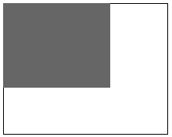

---
output:
  github_document:
    pandoc_args: --webtex=https://latex.codecogs.com/svg.latex?
---

<!-- README.md is generated from README.Rmd. Please edit that file -->

```{r, include = FALSE}
knitr::opts_chunk$set(
  collapse = TRUE,
  comment = "#>",
  fig.path = "man/figures/README-",
  out.width = "100%"
)
```

# spatLac: Spatial Lacunarity

<!-- badges: start -->

<!-- badges: end -->

The `spatLac` R package helps researchers compute Lacunarity for binary and continuous Spatial Raster objects. `spatLac` uses fast C++ code, allowing for low memory usage and multithreading.

-   [Installation](#installation)

-   [Lacunarity](#lacunarity)

-   [Examples](#examples)

-   [Citation](#citation)

## Installation

You can install the development version from [GitHub](https://github.com/) with:

``` r
# install.packages("devtools")
devtools::install_github("STBrinkmann/spatLac")
```

## Lacunarity

"Lacunarity" literally refers to the *gappiness* or *heterogeneity* of a fractal or non-fractal image. As a scale dependent measure of heterogeneity, [*Dong (2000)*](https://doi.org/10.1080/10824000009480530) introduced lacunarity for spatial heterogeneity measurements in GIS. Based on the research of [Plotnick et al. (1993)](https://doi.org/10.1007/BF00125351) he implemented a Lacunarity algorithm for raster images. [Hoechstetter et al. (2011)](https://doi.org/10.1016/j.ecocom.2011.01.001) further improved Lacunarity measurements for continuous images. In a recent paper [Labib et al. (2020)](https://doi.org/10.1016/j.compenvurbsys.2020.101501) applied Lacunarity on binary ([Land Use](https://www.nrcan.gc.ca/maps-tools-and-publications/satellite-imagery-and-air-photos/tutorial-fundamentals-remote-sensing/educational-resources-applications/land-cover-biomass-mapping/land-cover-land-use/9373)) and continuous ([NDVI](https://eos.com/make-an-analysis/ndvi/) and [LAI](https://land.copernicus.eu/global/products/lai)) raster images, to derive scale sensitive weights used in a buffer analysis to build multiple-exposure metrics.

To compute Lacunarity we use a sliding box algorithm, the box can be either square or round as demonstrated in the animation below.

 

### Lacunarity calculation algorithms

Lacunarity for binary raster images is calculated using Eq. 1-5, for continuous images only function 1 and 6 are being used.

Lacunarity $\Lambda(r)$ ("lambda") for box diameter $r$ of an image with width $W$ and length $L$ is beeing calculated as follows:

First the total number of boxes $N[r]$ can be described as (Eq. 1):
$$
\begin{align*}
  N[r] = (W - r + 1)(L - r + 1) && \text{(1)} 
\end{align*}
$$
Next, the box mass $S$ for each box of size $r$ is beeing calculated by taking the box sum, or the range of all box-values, for binary or continuous raster, respectively.

For **binary** images, the number of boxes of size $r$ containing box mass $S$ are counted as $n[S,r]$, and converted into a probability distribution $Q(S,r)$ by dividing by $N[r]$ (Eq. 2):
$$
\begin{align*}
  Q(S,r) = \cfrac{n[S,r]}{N[r]} && \text{(2)}
\end{align*}
$$
Next, the first and second moments of this probability distribution are estimated using Eq. (3), (4) respectively:
$$
\begin{align*}
  Z(1) = \sum{S(r)\times Q(S,r)} && \text{ (3)}
\end{align*}
$$
$$
\begin{align*}
  Z(2) = \sum{S^2(r)\times Q(S,r)} && \text{(4)}
\end{align*}
$$
Lacunarity $\Lambda(r)$ can now be computed as (Eq. 5):
$$
\begin{align*}
  \Lambda(r) = \cfrac{Z(2)}{Z^2(1)} && \text{(5)}
\end{align*}
$$


If the raster is **continuous** the first and second moment can be expressed as the mean $E[S(r)]$ and variance $Var[S(r)]$ of the box mass values, respectively. Lacunarity can now be derived as (Eg. 6):
$$
\begin{align*}
  \Lambda(r) = 1 + \cfrac{Var[S(r)]}{E^2[S(r)]} && \text{(6)}
\end{align*}
$$


$r$ should not be greater than half of the shorter dimension of the input raster. If $r$ is not provided by the user, it will be automatically generated as the function $r_p = 2^p + 1$, where $p$ is a whole number commencing at 1 until $r_p$ reaches half of the shorter dimension. 

## Examples

For demonstration purposes I replicated the examples provided by [Hoechstetter et al. (2011)](https://doi.org/10.1016/j.ecocom.2011.01.001).

```{r example, message=FALSE}
library(spatLac)
library(terra)

sample_rast <- rast("data_raw/hoechstetter.tif")
```
```{r echo=FALSE, fig.height=2, fig.width=6, dpi=1200}
plot(sample_rast, axes=FALSE, nr = 1)
```

```{r fig.height=5, fig.width=6, dev="svg"}
sample_lac <- lacunarity(x = sample_rast, r_vec = 3:50, plot = TRUE)
```


To compute Lacunarity for a larger study, it can be computed for all raster objects (ending with .tif) in a folder. Furthermore, individual and summary plots can be automatically created, too.
```{r eval = FALSE}
lacunarity(x = "folder_path_with_TIF_files",
           save_plot = "folder_path_to_save_plots")
```

## About

### Citation

Run this command to get info on how to cite this package.
```{r warning = FALSE}
citation("spatLac")
```

### Package contributors
Brinkmann, Sebastian (Creator and author) e-mail: [sebastian.brinkmann\@fau.de](mailto:sebastian.brinkmann@fau.de)

Dr. S.M. Labib (Contributor) e-mail: [sml80\@medschl.cam.ac.uk](mailto:sml80@medschl.cam.ac.uk)

## Bibliography
Dong P. (2000): Lacunarity for Spatial Heterogeneity Measurement in GIS. *Geographic Information Sciences* 6:1, pages 20-26. DOI: [10.1080/10824000009480530](https://doi.org/10.1080/10824000009480530).

Hoechstetter S., Walz U. and Thinh N.X. (2011): Adapting lacunarity techniques for gradient-based analyses of landscape surfaces. *Ecological Complexity* 8:3, pages 229-238. DOI: [10.1016/j.ecocom.2011.01.001](https://doi.org/10.1016/j.ecocom.2011.01.001).

Labib S.M., Lindley S. and Huck J.J. (2020): Scale effects in remotely sensed greenspace metrics and how to mitigate them for environmental health exposure assessment. *Computers, Environment and Urban Systems* 82. DOI: [10.1016/j.compenvurbsys.2020.101501](https://doi.org/10.1016/j.compenvurbsys.2020.101501).

Plotnick R.E., Gardner R.H. and O'Neill R.V. (1993): Lacunarity indices as measures of landscape texture. *Landscape Ecology* 8, pages 201–211. DOI: [10.1007/BF00125351](https://doi.org/10.1007/BF00125351)