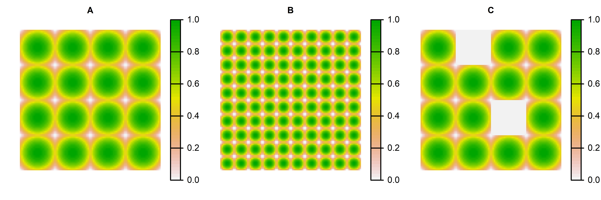

<!-- README.md is generated from README.Rmd. Please edit that file -->

# spatLac: Spatial Lacunarity

<!-- badges: start -->
<!-- badges: end -->

The `spatLac` R package helps researchers compute Lacunarity for binary
and continuous Spatial Raster objects. `spatLac` uses fast C++ code,
allowing for low memory usage and multithreading.

-   [Installation](#installation)

-   [Lacunarity](#lacunarity)

-   [Examples](#examples)

-   [Citation](#citation)

## Installation

You can install the development version from
[GitHub](https://github.com/) with:

``` r
# install.packages("devtools")
devtools::install_github("STBrinkmann/spatLac")
```

## Lacunarity

“Lacunarity” literally refers to the *gappiness* or *heterogeneity* of a
fractal or non-fractal image. As a scale dependent measure of
heterogeneity, [*Dong
(2000)*](https://doi.org/10.1080/10824000009480530) introduced
lacunarity for spatial heterogeneity measurements in GIS. Based on the
research of [Plotnick et al. (1993)](https://doi.org/10.1007/BF00125351)
he implemented a Lacunarity algorithm for raster images. [Hoechstetter
et al. (2011)](https://doi.org/10.1016/j.ecocom.2011.01.001) further
improved Lacunarity measurements for continuous images. In a recent
paper [Labib et
al. (2020)](https://doi.org/10.1016/j.compenvurbsys.2020.101501) applied
Lacunarity on binary ([Land
Use](https://www.nrcan.gc.ca/maps-tools-and-publications/satellite-imagery-and-air-photos/tutorial-fundamentals-remote-sensing/educational-resources-applications/land-cover-biomass-mapping/land-cover-land-use/9373))
and continuous ([NDVI](https://eos.com/make-an-analysis/ndvi/) and
[LAI](https://land.copernicus.eu/global/products/lai)) raster images, to
derive scale sensitive weights used in a buffer analysis to build
multiple-exposure metrics.

To compute Lacunarity we use a sliding box algorithm, the box can be
either square or round as demonstrated in the animation below.

 

### Lacunarity calculation algorithms

Lacunarity for binary raster images is calculated using Eq. 1-5, for
continuous images only function 1 and 6 are being used.

Lacunarity
")
(“lambda”) for box diameter
 of an image with width
 and length
 is beeing calculated as
follows:

First the total number of boxes
![N\[r\]](https://latex.codecogs.com/svg.latex?N%5Br%5D "N[r]") can be
described as (Eq. 1):

![
\\begin{align\*}
  N\[r\] = (W - r + 1)(L - r + 1) && \\text{(1)} 
\\end{align\*}
](https://latex.codecogs.com/svg.latex?%0A%5Cbegin%7Balign%2A%7D%0A%20%20N%5Br%5D%20%3D%20%28W%20-%20r%20%2B%201%29%28L%20-%20r%20%2B%201%29%20%26%26%20%5Ctext%7B%281%29%7D%20%0A%5Cend%7Balign%2A%7D%0A "
\begin{align*}
  N[r] = (W - r + 1)(L - r + 1) && \text{(1)} 
\end{align*}
")

Next, the box mass  for
each box of size  is
beeing calculated by taking the box sum, or the range of all box-values,
for binary or continuous raster, respectively.

For **binary** images, the number of boxes of size
 containing box mass
 are counted as
![n\[S,r\]](https://latex.codecogs.com/svg.latex?n%5BS%2Cr%5D "n[S,r]"),
and converted into a probability distribution
") by
dividing by
![N\[r\]](https://latex.codecogs.com/svg.latex?N%5Br%5D "N[r]") (Eq. 2):

![
\\begin{align\*}
  Q(S,r) = \\cfrac{n\[S,r\]}{N\[r\]} && \\text{(2)}
\\end{align\*}
](https://latex.codecogs.com/svg.latex?%0A%5Cbegin%7Balign%2A%7D%0A%20%20Q%28S%2Cr%29%20%3D%20%5Ccfrac%7Bn%5BS%2Cr%5D%7D%7BN%5Br%5D%7D%20%26%26%20%5Ctext%7B%282%29%7D%0A%5Cend%7Balign%2A%7D%0A "
\begin{align*}
  Q(S,r) = \cfrac{n[S,r]}{N[r]} && \text{(2)}
\end{align*}
")

Next, the first and second moments of this probability distribution are
estimated using Eq. (3), (4) respectively:

 = \sum{S(r)\times Q(S,r)} && \text{ (3)}
\end{align*}
")

 = \sum{S^2(r)\times Q(S,r)} && \text{(4)}
\end{align*}
")

Lacunarity
")
can now be computed as (Eq. 5):

 = \cfrac{Z(2)}{Z^2(1)} && \text{(5)}
\end{align*}
")

If the raster is **continuous** the first and second moment can be
expressed as the mean
![E\[S(r)\]](https://latex.codecogs.com/svg.latex?E%5BS%28r%29%5D "E[S(r)]")
and variance
![Var\[S(r)\]](https://latex.codecogs.com/svg.latex?Var%5BS%28r%29%5D "Var[S(r)]")
of the box mass values, respectively. Lacunarity can now be derived as
(Eg. 6):

![
\\begin{align\*}
  \\Lambda(r) = 1 + \\cfrac{Var\[S(r)\]}{E^2\[S(r)\]} && \\text{(6)}
\\end{align\*}
](https://latex.codecogs.com/svg.latex?%0A%5Cbegin%7Balign%2A%7D%0A%20%20%5CLambda%28r%29%20%3D%201%20%2B%20%5Ccfrac%7BVar%5BS%28r%29%5D%7D%7BE%5E2%5BS%28r%29%5D%7D%20%26%26%20%5Ctext%7B%286%29%7D%0A%5Cend%7Balign%2A%7D%0A "
\begin{align*}
  \Lambda(r) = 1 + \cfrac{Var[S(r)]}{E^2[S(r)]} && \text{(6)}
\end{align*}
")

## Examples

For demonstration purposes I replicated the examples provided by
[Hoechstetter et
al. (2011)](https://doi.org/10.1016/j.ecocom.2011.01.001).

``` r
library(spatLac)
library(terra)

sample_rast <- rast("data_raw/hoechstetter.tif")
```



``` r
sample_lac <- lacunarity(x = sample_rast, plot = TRUE)
```


To compute Lacunarity for a larger study, it can be computed for all
raster objects (ending with .tif) in a folder. Furthermore, individual
and summary plots can be automatically created, too.

``` r
lacunarity(x = "folder_path_with_TIF_files",
           save_plot = "folder_path_to_save_plots")
```

## About

### Citation

Run this command to get info on how to cite this package.

``` r
citation("spatLac")
#> 
#> To cite package 'spatLac' in publications use:
#> 
#>   Sebastian Brinkmann (2021). spatLac: R package for computing
#>   Lacunarity for Spatial Raster. R package version 1.0.
#>   https://github.com/STBrinkmann/spatLac
#> 
#> A BibTeX entry for LaTeX users is
#> 
#>   @Manual{,
#>     title = {spatLac: R package for computing Lacunarity for Spatial Raster},
#>     author = {Sebastian Brinkmann},
#>     year = {2021},
#>     note = {R package version 1.0},
#>     url = {https://github.com/STBrinkmann/spatLac},
#>   }
```

### Package contributors

Brinkmann, Sebastian (Creator and author) e-mail:
<sebastian.brinkmann@fau.de> Dr. S.M. Labib (ROLE) e-mail:
<sml80@medschl.cam.ac.uk>

## Bibliography

Dong P. (2000): Lacunarity for Spatial Heterogeneity Measurement in GIS.
*Geographic Information Sciences* 6:1, pages 20-26. DOI:
[10.1080/10824000009480530](https://doi.org/10.1080/10824000009480530).

Hoechstetter S., Walz U. and Thinh N.X. (2011): Adapting lacunarity
techniques for gradient-based analyses of landscape surfaces.
*Ecological Complexity* 8:3, pages 229-238. DOI:
[10.1016/j.ecocom.2011.01.001](https://doi.org/10.1016/j.ecocom.2011.01.001).

Labib S.M., Lindley S. and Huck J.J. (2020): Scale effects in remotely
sensed greenspace metrics and how to mitigate them for environmental
health exposure assessment. *Computers, Environment and Urban Systems*
82. DOI:
[10.1016/j.compenvurbsys.2020.101501](https://doi.org/10.1016/j.compenvurbsys.2020.101501).

Plotnick, R.E., Gardner, R.H. & O’Neill, R.V. (1993): Lacunarity indices
as measures of landscape texture. *Landscape Ecology* 8, pages 201–211.
DOI: [10.1007/BF00125351](https://doi.org/10.1007/BF00125351)
